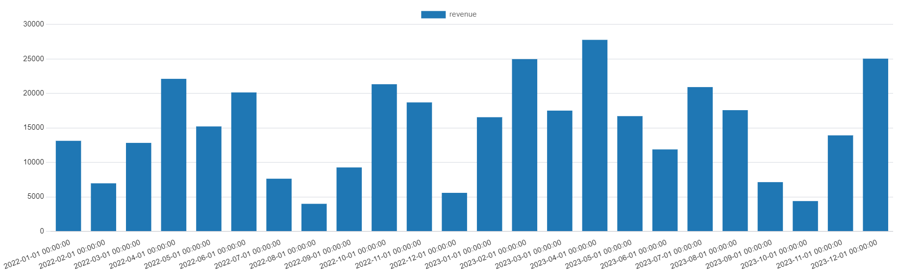
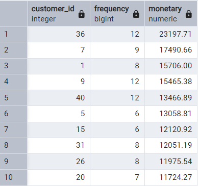
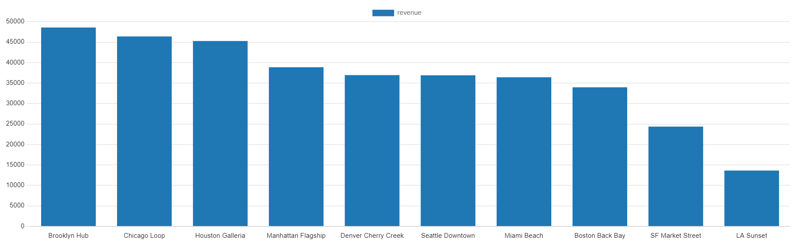

# 🛒 Retail Sales Analytics — SQL Portfolio Project

A production-style SQL project demonstrating advanced database design and analytics skills.  
Built with **PostgreSQL** — showcases real-world patterns an interviewer wants to see.

---

## 📂 Project Structure

```
retail_analytics/
├── 01_schema.sql       → Table definitions, constraints, indexes
├── 02_seed_data.sql    → Realistic sample data (10 stores, 50 customers, 500 orders)
├── 03_analytics.sql    → 20+ analytics queries across 6 topic areas
├── 04_views.sql        → Reusable views for a clean analytics layer
└── README.md           → This file
```

---

## 🗄️ Database Design

### Entity Relationship Overview

```
categories ──< products ──< order_items >── orders >── customers
                                               │
                                            stores
                                               │
                                          promotions
```

### Tables

| Table | Type | Description |
|-------|------|-------------|
| `stores` | Dimension | 10 retail locations across US regions |
| `categories` | Dimension | Hierarchical product categories (parent/child) |
| `products` | Dimension | 20 products with cost + list price |
| `customers` | Dimension | 50 customers with loyalty tiers |
| `promotions` | Dimension | 10 promotional campaigns |
| `orders` | Fact (header) | 500 orders across 2 years |
| `order_items` | Fact (detail) | Line items with computed `line_total` |

### Key Design Decisions
- **Generated column**: `line_total` is computed as `quantity × unit_price × (1 − discount_pct/100)` — always consistent, never stale
- **Composite index** on `(store_id, order_date)` for store + date range queries
- **Nullable FK** on `orders.promo_id` — orders can exist without a promotion
- **Self-referencing FK** on `categories.parent_id` — supports category hierarchies

---

## 📊 Analytics Coverage

### 1. Revenue Trends
- Month-over-month growth with `LAG()` window function
- Year-over-year quarterly comparison
- Rolling 3-month average with `ROWS 2 PRECEDING`
- Cumulative revenue with `SUM() OVER (ORDER BY ...)`

### 2. Customer RFM Segmentation
- Recency / Frequency / Monetary scoring with `NTILE(5)`
- Segment classification: Champions, Loyal, At Risk, Lost
- Customer Lifetime Value ranking with `DENSE_RANK()`

### 3. Product & Store Performance
- Top products by revenue, margin, and units sold
- Percentile ranking with `PERCENT_RANK()`
- Store leaderboard with `RANK()` window function
- Regional rollup with `GROUP BY ROLLUP()`

### 4. Discount Performance
- Discounted vs full-price order comparison
- Promotion ROI: revenue vs discount cost
- Discount elasticity bucketing

### 5. Seasonal Patterns
- Revenue by day of week
- Monthly heatmap data
- Category performance by season (Spring/Summer/Autumn/Winter)

### 6. Bonus Advanced Queries
- **Cohort retention analysis** — which signup cohorts are still buying?
- **Running totals** + percentage of total
- **Return rate** by product
- **Channel performance** breakdown (In-Store vs Online vs Mobile)

---

## 📸 Analytics Results

### Monthly Revenue Trend


Shows how revenue changes month-to-month across the 2-year dataset.

---

### Customer RFM Analysis


Identifies the most valuable customers based on **frequency and total spending**.

---

### Store Revenue Ranking


Ranks stores by total revenue generated from completed orders.

## 🚀 How to Run

### Prerequisites
- PostgreSQL 14+ (uses `GENERATED ALWAYS AS` column)

### Setup
```bash
# 1. Create the database
createdb retail_analytics

# 2. Connect and run files in order
psql -d retail_analytics -f 01_schema.sql
psql -d retail_analytics -f 02_seed_data.sql
psql -d retail_analytics -f 03_analytics.sql
psql -d retail_analytics -f 04_views.sql
```

### Quick Start (single command)
```bash
psql -d retail_analytics \
  -f 01_schema.sql \
  -f 02_seed_data.sql \
  -f 04_views.sql
```

---

## 💡 SQL Concepts Demonstrated

| Concept | Where Used |
|---------|------------|
| Window functions (`LAG`, `RANK`, `NTILE`, `PERCENT_RANK`) | Sections 1, 2, 3 |
| CTEs (Common Table Expressions) | All sections |
| `GROUP BY ROLLUP` for subtotals | Section 3 |
| Generated columns | `order_items.line_total` |
| Conditional aggregation (`CASE` inside `SUM`) | Section 6 |
| Self-referencing foreign key | `categories.parent_id` |
| Composite indexes | `idx_orders_store_date` |
| Date functions & truncation | Sections 1, 5 |
| `NULLIF` to prevent division-by-zero | Sections 2, 4 |
| Cohort analysis | Section 6 |

---

## 🛠️ Tools Used
- **PostgreSQL 14+**
- Compatible with: DBeaver, TablePlus, pgAdmin, DataGrip

---

## 📝 License
MIT — free to use, adapt, and include in your own portfolio.
